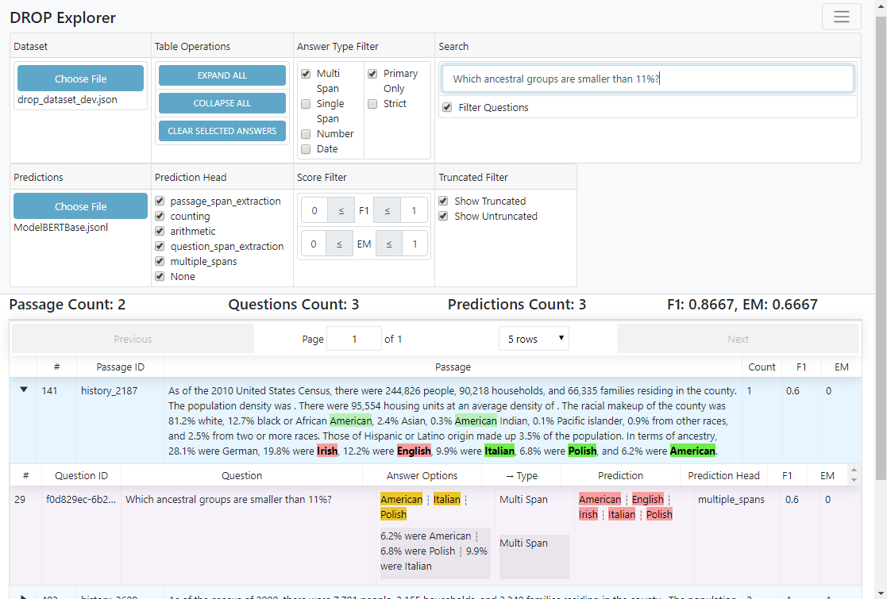

# [DROP Explorer](http://eladsegal.github.io/DROP-explorer)

This is a data explorer for the dataset [DROP: A Reading Comprehension Benchmark Requiring Discrete Reasoning Over Paragraphs](https://allennlp.org/drop).

Available at http://eladsegal.github.io/DROP-explorer.

Prediction files examples are available [here](https://github.com/eladsegal/project-NLP-AML/tree/master/predictions).

## Things to know

- Clicking on a question row will highlight a gold answer and the predicted answer.
- Multi-span answers are sorted
- The first answer displayed is the one in "answer", the rest are from "validated_answers" and only distinct answers are displayed. 

## Expected Predictions File Format

The expected predictions file format is JSONL, where each line is a JSON object that is the `output_dict` of an instance prediction.
The following members will be used and are required unless mentioned otherwise (they don't have to be correct, but just have the correct type):
- passage_id: string
- query_id: string
- answer: A JSON object with the following members:
    - value: The final prediction - A string or an array of strings
    - spans (optional): An array of arrays of the form `["p" (passage) / "q" (question), start_index, end_index (exclusive)]` used to make spans that the model used for prediction bold.
    - numbers (required and used only when the head is "arithmetic"): An array of objects of the form `{"value": number, "sign": -1/0/-1}` to construct the arithmetic expression used to arrive at the answer
- predicted_ability: The name of the head used for prediction 
- maximizing_ground_truth: The answer for which the highest EM and F1 scores were calculated, in the same format of an answer in the dataset.
- em (optional): The EM score calculated, a number
- f1 (optional): The F1 score calculated, a number
- max_passage_length (optional): The length of the passage that was considered for the model prediction, used to show which parts of the passage were truncated

## Known Issues

- Be aware that currently there is code that treat some heads names in a special way:
    - Predictions from "counting" head won't be highlighted
    - Predictions from "arithmetic" head are expected to have a member named "numbers" in "answer" which is an array.
